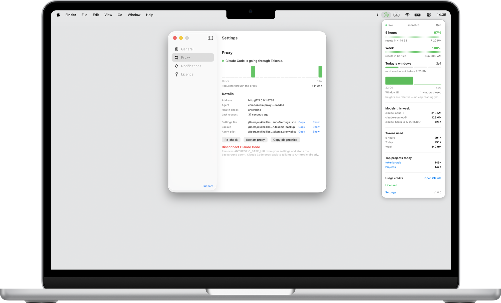

  

  # Tokenia

  A menu bar gauge for what's left of your Claude Code usage limit.

  

  

A macOS menu bar widget showing how much of your Claude Code usage limit is
left, and when it resets.

  

Click it for exact percentages, live countdowns to reset, and token spend.

**[tokenia.dev](https://tokenia.dev)** · $9.99 once, free for 7 days, no
subscription.

---

## Why it exists

Claude Code tells you that you have hit your limit *after* you hit it. There
is no public API to ask "how much is left" — Anthropic reports the usage
limit only in the headers of a real API response.

Tokenia reads those headers off the traffic you are already sending.

**It never makes an API request of its own.** No polling, no keep-alive
pings, no usage limit spent just to measure the usage limit. If Claude Code
is idle, the reading simply goes stale — and the widget says so instead of
pretending otherwise.

## Privacy, not a promise

Your OAuth token and the full text of every Claude Code conversation pass
through the local proxy that makes this possible. So:

- Request and response bodies are **never** written to disk or logged.
- The `Authorization` header is **never** logged — it is forwarded and
  forgotten.
- Only parsed numbers are kept: utilisation, status, reset times.
- Nothing is sent anywhere except `api.anthropic.com`, exactly as Claude Code
  would have sent it.

And since 2026-08-25 it is not even a promise you have to take on trust: **the
proxy — the part your token passes through — is open source** at
[tokenia-app/tokenia-proxy](https://github.com/tokenia-app/tokenia-proxy),
MIT-licensed, with the never-log rule pinned by a test
([`SecurityTests.swift`](https://github.com/tokenia-app/tokenia-proxy/blob/main/Tests/TokeniaProxyTests/SecurityTests.swift))
that runs in public CI on every change.

Full policy: [PRIVACY.md](PRIVACY.md).

## This repository

Tokenia is open-core. The proxy that handles your credentials is open source
at [tokenia-app/tokenia-proxy](https://github.com/tokenia-app/tokenia-proxy);
the widget, UI and licensing are closed — see [LICENSE.md](LICENSE.md) for
what that means and does not mean. This repository exists for the parts that
are not the source: release notes, licensing and privacy terms, and a place
to ask questions or report a problem.

- **The open proxy source:** [tokenia-proxy](https://github.com/tokenia-app/tokenia-proxy)
- **Questions, bugs, feature requests:** [Discussions](../../discussions)
- **Licence terms, trial, refunds:** [LICENSE.md](LICENSE.md)
- **Privacy policy:** [PRIVACY.md](PRIVACY.md)
- **Support:** support@tokenia.dev

## Licence

Tokenia is proprietary software. See [LICENSE.md](LICENSE.md) for the terms
that apply to a purchased or trial copy. This repository's own contents
(this README, the licence and privacy text) may be copied and shared freely —
it is documentation, not the product.
